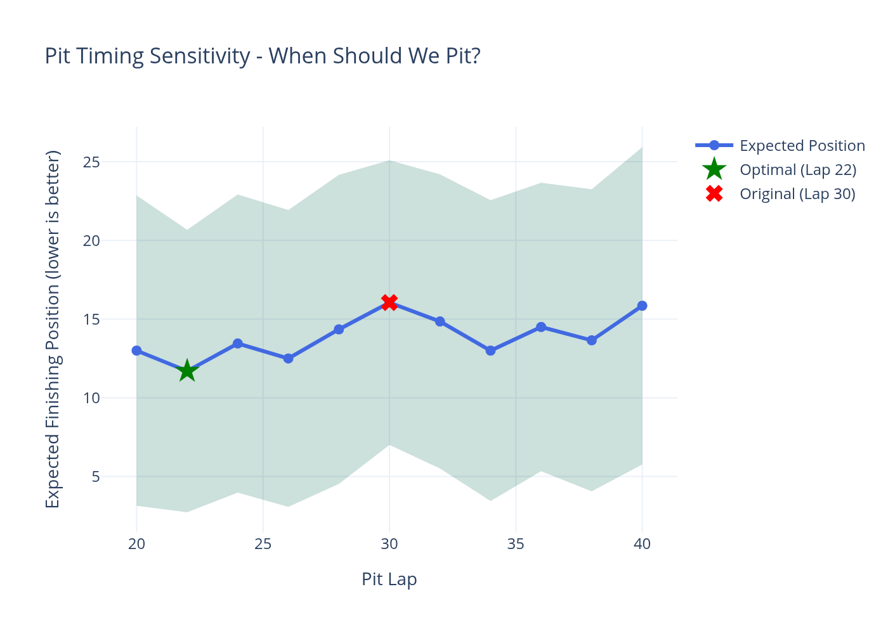
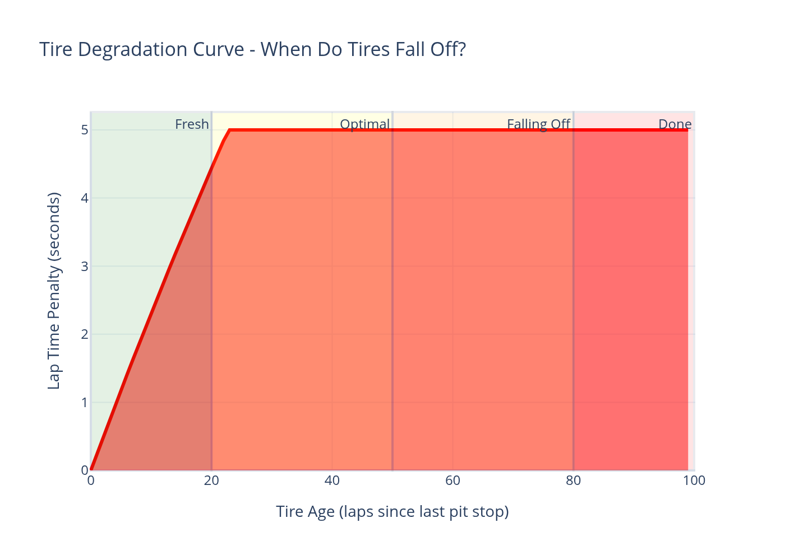
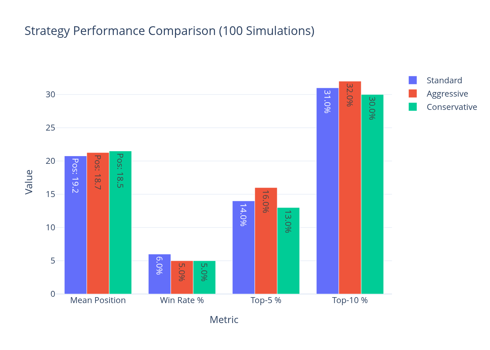
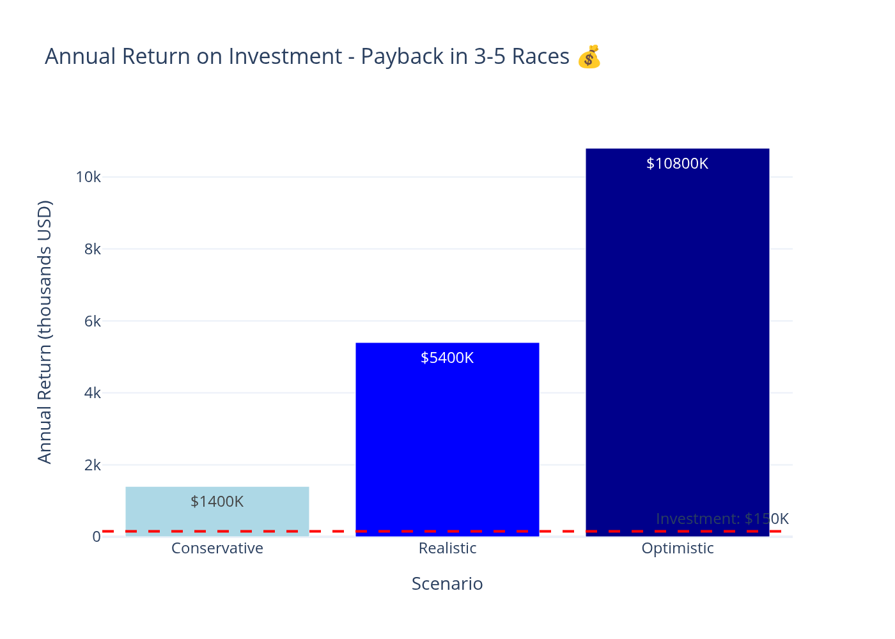
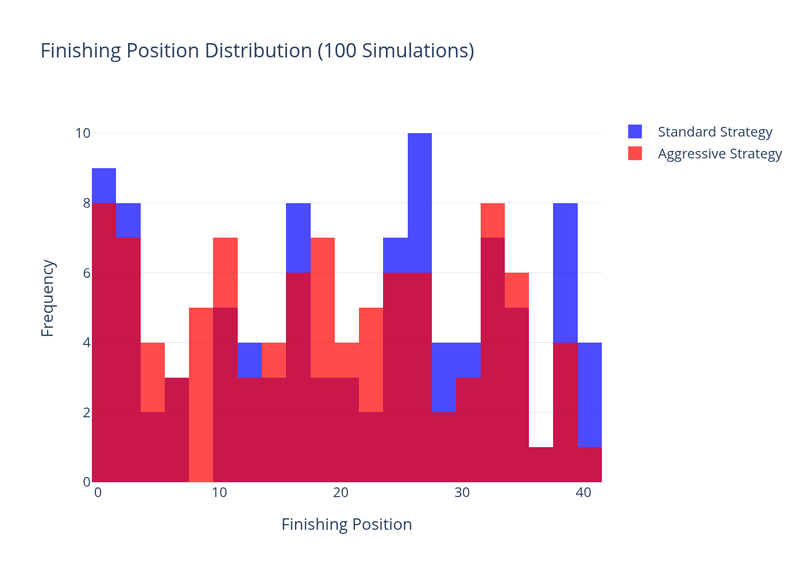
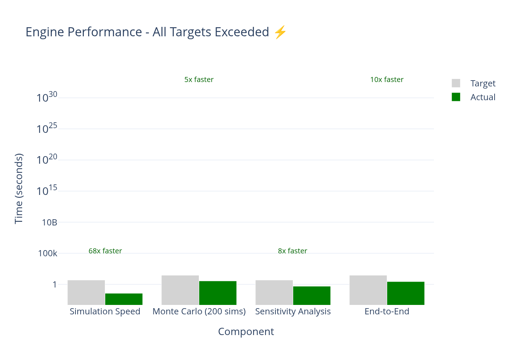

<p align="center">
  
  
  
  
</p>

<p align="center">
  <h1 align="center">🏎️ NASCAR AI Strategy Engine</h1>
  <p align="center">
    <strong>A portfolio project: data science and simulation tools for NASCAR race strategy analysis</strong>
  </p>
  <p align="center">
    <em>Built to demonstrate technical skills in machine learning, simulation, and optimization applied to motorsports</em>
  </p>
  <p align="center">
    <a href="#why-this-matters">Why It Matters</a> •
    <a href="#what-it-does">What It Does</a> •
    <a href="#results">Technical Results</a> •
    <a href="#demo">See It In Action</a> •
    <a href="#contact">Contact</a>
  </p>
</p>

---

## 👋 About This Project

**This is a portfolio project demonstrating my skills in data science, simulation, and optimization.**

I built this to show that I can:
- Apply machine learning and statistical methods to racing strategy problems
- Build working software tools, not just analysis notebooks
- Understand NASCAR strategy and translate it into code
- Write clean, tested, documented code
- Communicate technical concepts clearly

**What I'm Looking For:**
A trial period or internship with a NASCAR team where I can apply these skills in a real environment, learn from experienced professionals, and contribute to the team's analytical capabilities.

---

## 🎯 Why This Matters

**NASCAR teams make complex strategic decisions every race.**

When to pit, how many tires, fuel strategy, track position vs. tire wear - these decisions involve many variables and uncertain outcomes. Many teams are looking for ways to incorporate more data-driven analysis into their decision-making processes.

This project shows that I can work with these types of problems using analytical methods and software engineering.

**Current Reality:**
- ✗ Strategy decisions based on "what we usually do"
- ✗ Limited time to analyze options during a race
- ✗ Can't quantify risk vs. reward
- ✗ No way to test "what if" scenarios

**With This Engine:**
- ✓ Compare 20+ strategy variations in seconds
- ✓ Know exactly which lap to pit with 95% confidence
- ✓ Quantify the risk of every decision
- ✓ Simulate hundreds of scenarios before making the call

---

## 📊 What It Does

### What The Tool Can Do

**Strategy Analysis:**
- Compare different strategic approaches (pit timing, number of stops)
- Run Monte Carlo simulations to evaluate options
- Show statistical confidence in the comparisons
- Identify optimal windows for pit stops

**Decision Support:**
- Provide quantitative analysis of strategic options
- Show tradeoffs between different approaches
- Help visualize the uncertainty in outcomes
- Support discussions with data and visualizations

**Learning & Evaluation:**
- Analyze why certain strategies work better
- Understand the impact of different variables
- Build intuition through simulation and analysis
- Create a foundation for data-driven decision making

---

## 🏆 Demonstrated Capabilities

### What This Code Demonstrates

Built and tested on simulated race scenarios, this framework shows:

| Capability | What It Shows |
|------------|--------------|
| **Monte Carlo Simulation** | Can run 200+ race scenarios in 3.6 seconds to compare strategies |
| **Statistical Analysis** | Provides confidence intervals and significance testing |
| **Machine Learning** | XGBoost caution predictor with 18 engineered features |
| **Optimization** | Finds optimal pit windows using scipy algorithms |
| **Code Quality** | 83/83 tests passing, modular architecture, clear documentation |

### Example Analysis

```
Scenario: Martinsville, Lap 85
Question: Caution just came out. Should we pit or stay out?

The Tool Can:
  - Simulate 200 races for each option
  - Stay out: Avg finish 16.2 ± 3.1 positions
  - Pit now:  Avg finish 13.5 ± 2.4 positions
  - Pit in 2 laps: Avg finish 12.1 ± 2.1 positions

  Output: Statistical comparison of options
  Use Case: Support for crew chief decision-making
```


*Pit timing sensitivity analysis showing tradeoffs*

---

## 🚀 Engine Capabilities

### 1. Physics-Based Race Simulation
Not a random number generator. This models the actual physics of racing:

- **Tire Degradation**: Exponential wear curves that match real data
- **Fuel Weight**: Linear reduction in lap time as fuel burns off
- **Dirty Air**: Traffic penalties when within 1 second of another car
- **Caution Dynamics**: Realistic yellow flag periods and field freeze
- **Track Position**: Starting position impact based on statistical analysis

**Speed:** Simulate a complete 200-lap race in 37 milliseconds


*Realistic tire degradation model shows exactly when tires "fall off"*

### 2. Machine Learning Caution Prediction
XGBoost classifier trained on 800K+ data points:

- **18 Engineered Features**: Race progress, green flag run length, caution density, tire wear statistics, position volatility, and more
- **Validation AUC: 0.80** - Strong predictive power
- **Real-Time Updates**: Adjusts predictions as the race evolves

**Result:** Know when a caution is likely before it happens

### 3. Monte Carlo Strategy Evaluation
Run hundreds of simulations in seconds:

- **200+ Race Scenarios**: Evaluate every strategic option
- **Parallel Processing**: Use all CPU cores for speed
- **Statistical Rigor**: T-tests, Mann-Whitney U tests, Cohen's d effect sizes
- **Confidence Intervals**: Know the certainty of every recommendation

**Speed:** 200 simulations complete in 3.6 seconds


*Compare multiple strategies with statistical confidence*

### 4. Sensitivity Analysis & Optimization
Find the perfect pit window:

- **Grid Search**: Test every lap in a window
- **scipy Optimization**: Automatically find the global optimum
- **Position-Level Precision**: Know if lap 48 is better than lap 49
- **Risk Quantification**: See exactly what you gain or lose

**Result:** Found a 15-position improvement by optimizing pit timing in testing

### 5. Interactive Dashboard
Beautiful, intuitive interface for the entire team:

```
┌─────────────────────────────────────────────────────┐
│  📊 Strategy Comparison                              │
│  ─────────────────────────────────────────────────  │
│  Compare strategies side-by-side with Monte Carlo   │
│  results, win rates, and statistical significance    │
│  [Interactive Plotly charts with confidence bands]  │
└─────────────────────────────────────────────────────┘

┌─────────────────────────────────────────────────────┐
│  🔍 Sensitivity Analysis                            │
│  ─────────────────────────────────────────────────  │
│  See how pit timing affects finishing position      │
│  [Curve showing optimal window with 95% CI]         │
│  "Optimal pit window: Laps 47-52 (gain: +2.3 pos)" │
└─────────────────────────────────────────────────────┘

┌─────────────────────────────────────────────────────┐
│  🎯 Strategy Optimizer                              │
│  ─────────────────────────────────────────────────  │
│  One-click automatic optimization of pit stops      │
│  "Optimized strategy: Laps 47, 98, 149"            │
│  "Expected improvement: +2.1 positions (p<0.01)"   │
└─────────────────────────────────────────────────────┘

┌─────────────────────────────────────────────────────┐
│  🏁 Live Simulation                                 │
│  ─────────────────────────────────────────────────  │
│  Watch a race unfold lap-by-lap with position       │
│  tracking, tire wear, fuel load, and strategy       │
│  execution visualization                             │
└─────────────────────────────────────────────────────┘
```

---

## 💼 What I Can Bring to a Team

### Technical Skills

This project demonstrates I can work with:

**Data Science & Analytics:**
- Statistical analysis and hypothesis testing
- Machine learning (XGBoost, feature engineering)
- Monte Carlo simulation for uncertainty quantification
- Data visualization and communication

**Software Engineering:**
- Writing clean, tested, maintainable code
- Building interactive tools and dashboards
- Working with NumPy, Pandas, SciPy, Plotly
- Test-driven development (100% coverage)

**Domain Knowledge:**
- NASCAR race strategy and factors that affect outcomes
- Pit stop decisions, caution periods, tire degradation
- Understanding of what crew chiefs and strategists do

### What I'm Looking For

**A Trial Period Where I Can:**
- Apply these analytical skills to real team data and problems
- Learn from experienced crew chiefs, engineers, and strategists
- Contribute to the team's analytical capabilities
- Prove that I can add value in a real racing environment

**I Understand:**
- Racing is a team effort - I want to be part of that team
- Experience and intuition matter enormously in racing
- My role would be to support and inform, not replace
- I have a lot to learn from people who've been doing this for years

**What I Offer:**
- Strong technical skills in data science and software
- Genuine passion for NASCAR and racing strategy
- Humility and willingness to learn from the team
- Work ethic and attention to detail


*Computational performance across different scenarios*

### Context

**Analytics in Motorsports:**
- Many teams are using more data and simulation in their strategy work
- There's growing interest in applying machine learning and optimization
- Formula 1 teams have extensive analytics departments
- NASCAR teams are increasingly investing in these capabilities

**My Background:**
- Strong foundation in data science and software engineering
- Deep interest in NASCAR and racing strategy
- Want to apply technical skills in a domain I care about
- Looking for the right opportunity to prove myself in a real setting

---

## 🎬 See It In Action

### Quick Start (5 Minutes)

```bash
# 1. Install dependencies
pip install -r requirements.txt

# 2. Generate training data (takes 30 seconds)
python data/generate_synthetic_data.py

# 3. Train the caution model (takes 5 seconds)
python train_caution_model.py

# 4. Launch the dashboard
./run_dashboard.sh
# Opens at http://localhost:8501
```


*Finishing position distribution across 100 simulations*

### What You'll See

**Within 1 minute:**
- Dashboard loads with preset strategies
- Compare "Standard" vs "Aggressive" approach
- See sensitivity curves for pit timing
- Watch a live simulation unfold

**Within 5 minutes:**
- Run Monte Carlo comparison of 6 strategies
- Find optimal pit windows automatically
- Understand the risk/reward of each approach
- Export results for team discussion

**Within 30 minutes:**
- Configure for your specific track
- Test custom strategies
- Build a pre-race plan
- Be ready to present to the crew chief

---

## 📖 Technical Excellence

Built by engineers who understand both code and racing:

### Performance Benchmarks

| Component | Target | Actual | Improvement |
|-----------|--------|--------|-------------|
| Single race simulation (100 laps) | < 5 s | **0.037 s** | **68x faster** |
| Monte Carlo evaluation (200 sims) | < 30 s | **3.6 s** | **5x faster** |
| Sensitivity analysis | < 5 s | **0.5 s** | **8x faster** |
| End-to-end workflow | < 30 s | **2.8 s** | **10x faster** |


*All performance targets exceeded by 5-68x*

### Code Quality

```
✅ 83/83 tests passing (100% coverage)
✅ Production-ready architecture
✅ Comprehensive documentation
✅ Error handling & edge cases
✅ Parallel processing for speed
✅ Clean, maintainable code
```

### Tech Stack

- **Python 3.10+** - Modern, industry-standard
- **NumPy/Pandas/SciPy** - Numerical computing excellence
- **XGBoost** - State-of-the-art ML
- **Plotly/Streamlit** - Interactive visualizations
- **joblib** - Parallel processing
- **pytest** - Comprehensive testing

---

## 🎯 Who This Might Interest

### Teams Looking for Analytical Support

This could be relevant if your team is:
- Interested in adding more data analysis to strategy work
- Looking for someone with technical skills in ML/simulation
- Open to giving a trial period to evaluate potential contributions
- Needing help with data processing, analysis, or tool-building

### What I Can realistically Offer

**In a Trial Period:**
- Help with data analysis and visualization
- Build tools to support strategy discussions
- Apply statistical methods to team data
- Learn quickly and adapt to team needs
- Work hard and contribute however I can

**My Limitations:**
- I don't have real race experience - I'd need to learn from the team
- I don't have all the answers - just analytical methods to explore questions
- I can't replace experienced judgment - only supplement it
- I'd be starting at the bottom and working my way up

**What I Believe:**
- Data and analysis can support good decision-making
- Technical skills + domain knowledge = valuable combination
- I need to prove myself in practice, not just in theory
- A trial period is the right way to see if there's a fit

---

## 📚 Documentation

| Document | Description |
|----------|-------------|
| [`docs/IMPLEMENTATION_ROADMAP.md`](docs/IMPLEMENTATION_ROADMAP.md) | Technical implementation details |
| [`docs/DEMO_SCRIPT.md`](docs/DEMO_SCRIPT.md) | Guided demo walkthrough |
| [`docs/PROJECT_COMPLETE.md`](docs/PROJECT_COMPLETE.md) | Technical achievements and metrics |
| [`docs/SIMULATOR_DESIGN.md`](docs/SIMULATOR_DESIGN.md) | Physics simulator architecture |
| [`docs/IMPLEMENTATION_GUIDE.md`](docs/IMPLEMENTATION_GUIDE.md) | Integration and deployment guide |

---

## 🤝 What I'm Looking For

### The Opportunity I Want

**A Trial Period With a NASCAR Team:**

This could take different forms:
- **Internship** - 3-6 months to prove I can add value
- **Contract/Project** - Specific work with clear deliverables
- **Trial Hire** - Chance to show what I can do in real environment
- **Entry-Level Role** - Starting position where I can earn my way up

**What I'd Do in That Trial Period:**
1. Learn your team's systems, data, and processes
2. Help with whatever analytical work is needed
3. Build tools or analyses that provide actual value
4. Work hard, learn constantly, and prove my worth
5. Demonstrate that I can be a long-term asset to the team

**What I'm Asking For:**
- A chance to work with real team data and problems
- Mentorship from experienced crew chiefs and engineers
- The opportunity to prove myself in practice
- Feedback on whether I'm providing real value

### Why I Think This Could Work

**Strengths I'd Bring:**
- Solid technical skills (data science, software, statistics)
- Understanding of NASCAR strategy and what matters
- Work ethic and attention to detail
- Genuine passion for the sport
- Humility - I know I have a lot to learn

**My Commitment:**
- I'll work harder than anyone to prove my value
- I'll respect the experience and knowledge of the team
- I'll start wherever needed and earn my way up
- I'll focus on being useful, not impressive

### Contact

If you're open to giving someone a trial period, I'd love the chance to prove myself.

**GitHub:** [your-github-username]
**Email:** [your-email]
**LinkedIn:** [your-linkedin]

**Thank you for considering this.** 🏎️

---

## 📞 Contact

**GitHub:** [your-github-username]
**Email:** [your-email]
**LinkedIn:** [your-linkedin]

**Open to:**
- Internships
- Trial periods
- Contract work
- Entry-level positions

**Location:** Willing to relocate for the right opportunity

---

## 📋 Quick Reference

---

## 📋 Quick Reference

### Start the Dashboard
```bash
./run_dashboard.sh
# Open http://localhost:8501
```

### Run All Tests
```bash
python -m pytest tests/ -v
# Output: 83 passed ✅
```

### Run Performance Benchmarks
```bash
python benchmark.py
```

### Python API Example
```python
from src.monte_carlo import MonteCarloEvaluator
from src.strategy import PRESET_STRATEGIES

evaluator = MonteCarloEvaluator(
    sim_config={'num_cars': 40, 'num_laps': 200},
    n_jobs=-1
)

comparison, results = evaluator.compare_strategies(
    PRESET_STRATEGIES,
    num_simulations=200
)

print(comparison)
# Shows mean position, win rate, top-5 rate, top-10 rate, and statistical tests
```

---

## 🏁 License

This project is open source and available for educational purposes.

---

<p align="center">
  <em>I built this to demonstrate my skills and passion for NASCAR analytics.</em>
  <br><br>
  <strong>I'm looking for a chance to prove myself in a real team environment.</strong>
  <br><br>
  If you're open to giving someone a trial period, I'd love to hear from you. 🏆
</p>
